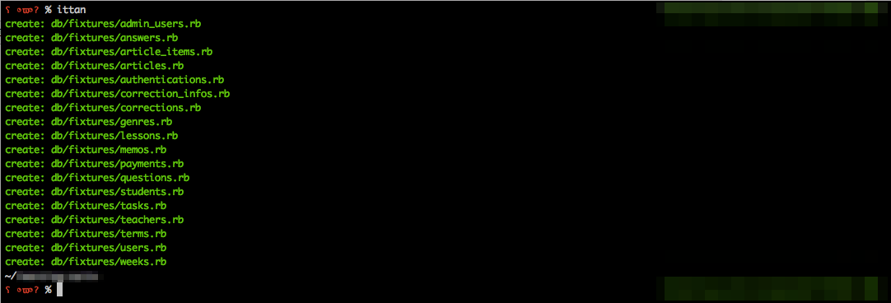

# Ittan

Ittan (一旦) is a Gem that generates seed file from schema.rb for the time being.

※ It is assuming seed_fu.



## Installation

Add this line to your application's Gemfile:

```ruby
gem install ittan
```

## Usage

```
$ ittan
```

## Contributing

Welcome

## License

The gem is available as open source under the terms of the [MIT License](http://opensource.org/licenses/MIT).

